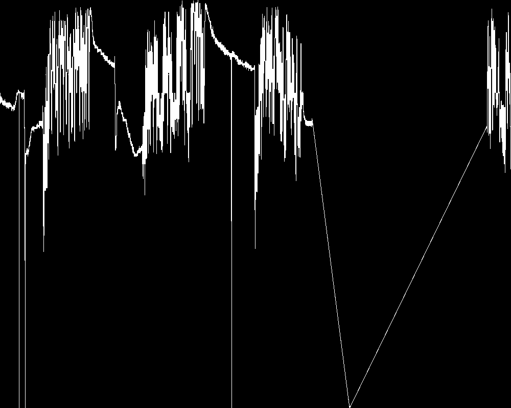

# 

# Readme

## 1. prepare data

Using the following IoTDB export-csv command to export csv data, which are already in this repository.

-   raw data `test.csv`: 273767 points

```bash
.\export-csv.bat -h 127.0.0.1 -p 6667 -u root -pw root -q "select ZT11529 from root.group_69.`1701`" -tf timestamp -td . -linesPerFile 300000
```

-   M4 data `test-M4.csv`: 2334 points

```bash
.\export-csv.bat -h 127.0.0.1 -p 6667 -u root -pw root -q "select M4(ZT11529,'timeInterval'='208653','displayWindowBegin'='1591717867194','displayWindowEnd'='1591926520194') from root.group_69.`1701`" -tf timestamp -td .
```

-   M4 data but using double sampling time interval (which is not the ideal usage of M4) `test-M4-doubleTimeInterval.csv`: 1242 points

```bash
.\export-csv.bat -h 127.0.0.1 -p 6667 -u root -pw root -q "select M4(ZT11529,'timeInterval'='417306','displayWindowBegin'='1591717867194','displayWindowEnd'='1591926520194') from root.group_69.`1701`" -tf timestamp -td .
```

## 2. using python.cairos to plot

As mentioned in the original M4 paper, the author uses [cairos](https://github.com/pygobject/pycairo) to plot the line chart. So `cairos_plot.py` tries to reproduce the plot process.

```python
python cairos_plot.py
```

The program will render pngs for the `test.csv`, `test-M4.csv`, `test-M4-doubleTimeInterval.csv`, and compare the differences between the raw data png and M4 sampling data pngs.

## 3. current results

pngs are as follows:

-   for `test.csv`



-   for `test-M4.csv`:


the SSIM of raw and M4 is : 0.9949333406406351

the mse of raw and M4 is : 0.0007025

-   for `test-M4-doubleTimeInterval.csv`:


the SSIM of raw and M4-doubleTimeInterval is : 0.9737598563976496

the mse of raw and M4-doubleTimeInterval is : 0.00575375


## 4. TODOS

The mse of raw and M4 is not zero, which should be zero according to the original M4 paper.

One possible reason is that the line width may play some role in the rendering mechanism of cairos, which is not discussed in the original M4 paper.
