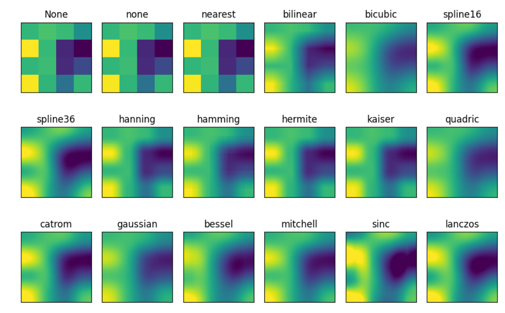
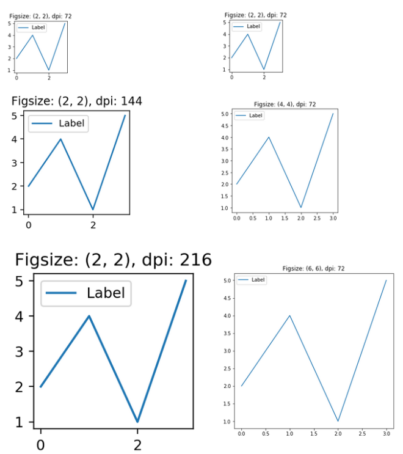
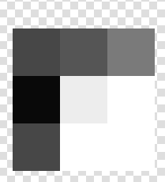
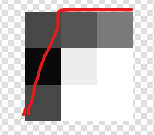
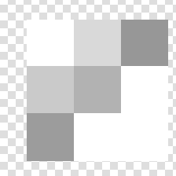
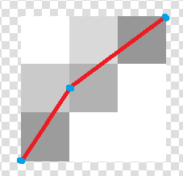

# matplotlib
图片像素检查网站：https://pixspy.com/

https://www.reddit.com/r/algorithms/comments/268b49/algorithm_to_draw_antialiased_lines_of_a_certain/

> [Algorithm to draw anti-aliased lines of a certain thickness]
Hi folks,
I'm trying to find a good algrithm for the drawing of anti-aliased lines. So far I have found the algorithm by Xiaolin Wu and the algorithm by Gupta Sprull.
Is there a way to modify those algorithms to support lines with a thickness > 1 pixel or is there some algorithm which already supports a certain "pen" size?
I appreciate your help.

https://www.allegro.cc/forums/thread/589925

> Wu lines are for lines that are one pixel thick. Nothing else. I will stitch using the trick you gave first (rect + wu lines) or use some hardware provided functions with Opengl or DirectX to do some antialiasing.

Question: matplotlib是如何做宽线条的antialiasing的？是没有用line drawing algorithm而是当作平行四边形状去画？还是当作平行四边形的边边用line drawing算法内部完全在内的就在内？还是有什么专门的可以支持thick line的line drawing algorithm?

https://en.wikipedia.org/wiki/Line_drawing_algorithm


https://www.inf.ed.ac.uk/teaching/courses/cg/lectures/cg4_2012.pdf


aliasing:
- jaggies锯齿
- moire云纹
- stairstepping
- the crawlies

antialiasing algorithm:
- https://www.youtube.com/watch?v=9R_5Bp5xEV8: Multisample anti-aliasing (MSAA) 一个像素内上采样之后看采样点落在像素内的比例


- https://en.wikipedia.org/wiki/Xiaolin_Wu%27s_line_algorithm: "Bresenham's algorithm draws lines extremely quickly, but it does not perform anti-aliasing. In addition, it cannot handle any cases where the line endpoints do not lie exactly on integer points of the pixel grid. A naive approach to anti-aliasing the line would take an extremely long time. Wu's algorithm is comparatively fast, but is still slower than Bresenham's algorithm. The algorithm consists of drawing pairs of pixels straddling the line, each coloured according to its distance from the line. Pixels at the line ends are handled separately. Lines less than one pixel long are handled as a special case."


- Bresenham's line algorithm 布雷森汉姆直线算法 https://en.wikipedia.org/wiki/Bresenham%27s_line_algorithm: Bresenham's line algorithm is a line drawing algorithm that determines the points of an n-dimensional raster that should be selected in order to form a close approximation to a straight line between two points. While algorithms such as Wu's algorithm are also frequently used in modern computer graphics because they can support antialiasing, Bresenham's line algorithm is still important because of its speed and simplicity. The label "Bresenham" is used today for a family of algorithms extending or modifying Bresenham's original algorithm.


plt.plot(t,v,'k',linewidth=1,antialiased=True):


plt.plot(t,v,'k',linewidth=1,antialiased=False)


https://www.includehelp.com/python/antialiasing-in-plotting.aspx

## how to disable antialias matplotlib

昨天知道了cairos无法真的关掉antialias，最多是从灰度图用一个阈值二分化得到二值图像，antialias仍然对结果像素有影响作用。

--

https://matplotlib.org/2.0.2/examples/pylab_examples/image_interp.html


### interpolation overview

https://matplotlib.org/stable/gallery/images_contours_and_fields/interpolation_methods.html

>   If *interpolation* is None, it defaults to the `rcParams["image.interpolation"]` (default: `'antialiased'`). If the interpolation is `'none'`, then no interpolation is performed for the Agg, ps and pdf backends. Other backends will default to `'antialiased'`.
>
>   For the Agg, ps and pdf backends, `interpolation='none'` works well when a big image is scaled down, while `interpolation='nearest'` works well when a small image is scaled up.




### plt.imshow

https://matplotlib.org/stable/api/_as_gen/matplotlib.pyplot.imshow.html

Display data as **an image, i.e., on a 2D regular raster.**

>   **interpolation**: str, default: `rcParams["image.interpolation"]` (default: `'antialiased'`)
>
>   The interpolation method used.
>
>   Supported values are 'none', 'antialiased', 'nearest', 'bilinear', 'bicubic', 'spline16', 'spline36', 'hanning', 'hamming', 'hermite', 'kaiser', 'quadric', 'catrom', 'gaussian', 'bessel', 'mitchell', 'sinc', 'lanczos', 'blackman'.
>
>   **If *interpolation* is 'none', then no interpolation is performed on the Agg, ps, pdf and svg backends. Other backends will fall back to 'nearest'. Note that most SVG renderers perform interpolation at rendering and that the default interpolation method they implement may differ.**
>
>   If *interpolation* is the default 'antialiased', then 'nearest' interpolation is used if the image is upsampled by more than a factor of three (i.e. the number of display pixels is at least three times the size of the data array). If the upsampling rate is smaller than 3, or the image is downsampled, then 'hanning' interpolation is used to act as an anti-aliasing filter, unless the image happens to be upsampled by exactly a factor of two or one.
>
>   See [Interpolations for imshow](https://matplotlib.org/stable/gallery/images_contours_and_fields/interpolation_methods.html) for an overview of the supported interpolation methods, and [Image antialiasing](https://matplotlib.org/stable/gallery/images_contours_and_fields/image_antialiasing.html) for a discussion of image antialiasing.
>
>   Some interpolation methods require an additional radius parameter, which can be set by *filterrad*. Additionally, the antigrain image resize filter is controlled by the parameter *filternorm*.
>
>   ---
>
>   **interpolation_stage**{'data', 'rgba'}, default: 'data'
>
>   If 'data', interpolation is carried out on the data provided by the user. If 'rgba', the interpolation is carried out after the colormapping has been applied (visual interpolation).

### Rasterization for vector graphics

https://matplotlib.org/stable/gallery/misc/rasterization_demo.html

-   Setting rasterization only affects vector backends such as PDF, SVG, or PS.

-   **The storage size and the resolution of the rasterized artist is determined by its physical size and the value of the `dpi` parameter passed to [`savefig`](https://matplotlib.org/stable/api/figure_api.html#matplotlib.figure.Figure.savefig).**


### dpi, pixel 

https://stackoverflow.com/questions/47633546/relationship-between-dpi-and-figure-size

A figure of `figsize=(w,h)` will have `px, py = w*dpi, h*dpi  # pixels`



还是不太懂


### 精确控制savefig像素大小 / matplotlib savefig without axis or padding

#### trial 1: NO

```python
w=800
h=200
dpi=50

data_file='test.csv'
timestamp=pd.to_datetime(pd.read_csv(data_file).iloc[:,0])
value=pd.read_csv(data_file).iloc[:,1].to_numpy()

fig=plt.figure(figsize=(w/dpi,h/dpi), dpi=dpi, frameon=False)
ax = plt.Axes(fig, [0., 0., 1., 1.])
ax.set_axis_off()
fig.add_axes(ax)
plt.plot(timestamp,value,'k')
plt.savefig(data_file+'.png', bbox_inches='tight',pad_inches=0)
```

不行，虽然fig像素是对了，是800*200像素，但是坐标轴的位置还是留着空着，原因：

>   If we just say plt.axis('off'),
>   # they are still used in the computation of the image padding.


#### trial-2: YES!!!!

https://gist.github.com/kylemcdonald/bedcc053db0e7843ef95c531957cb90f

```python
def full_frame(width=None, height=None, dpi=None):
    import matplotlib as mpl
    # First we remove any padding from the edges of the figure when saved by savefig. 
    # This is important for both savefig() and show(). Without this argument there is 0.1 inches of padding on the edges by default.
    mpl.rcParams['savefig.pad_inches'] = 0
    figsize = None if width is None else (width/dpi, height/dpi)
    fig = plt.figure(figsize=figsize,dpi=dpi)
    # Then we set up our axes (the plot region, or the area in which we plot things).
    # Usually there is a thin border drawn around the axes, but we turn it off with `frameon=False`.
    ax = plt.axes([0,0,1,1], frameon=False)
    # Then we disable our xaxis and yaxis completely. If we just say plt.axis('off'),
    # they are still used in the computation of the image padding.
    ax.get_xaxis().set_visible(False)
    ax.get_yaxis().set_visible(False)
    # Even though our axes (plot region) are set to cover the whole image with [0,0,1,1],
	# by default they leave padding between the plotted data and the frame. We use tigher=True
	# to make sure the data gets scaled to the full extents of the axes.
    plt.autoscale(tight=True)
    
full_frame()
plt.plot(X)
plt.savefig('fig.png')
plt.show()
```


## 观察

```
time,value
0,0
1,3
3,3
```

v_min= 0.0
v_max= 3.0
t_min= 0
t_max_temp= 3
t_max= 3

https://pixspy.com/



也就是说，x轴映射的t范围是[0,3]，y轴映射的v范围是[0,3]，连线的三个(t-v)点是(0,0),(1,3),(3,3)

>   (t-tmin)/(tmax-tmin)*WIDTH

Q1: 从t-v到x-y的映射是如何的？如果按照等比例映射，则三个(x-y)点是(0,0),(1,3),(3,3)

Q2: 从x-y到i-j的映射是如何的？



是这样吗？然后线宽超过1的那种

-   设置line.set_antialiased(False) # turn off antialiasing 或者 plt.plot(t,v,'k',linewidth=1,antialiased=False)之后：


这是？这是把灰度图按照阈值0二分化？

https://github.com/matplotlib/matplotlib/issues/6134/

-   把数据点修改成如下之后：

```
time,value
0,0
1,1.5
3,3
```






是这样吗？看起来好像是根据像素各自内经过的面积决定像素灰度深浅。但是第一列第二行的各自深度是比第二列第三行的格子浅的，但是从我画的线条看起来似乎前者经过的长度更长啊，难道是data interpolation？不是看线条经过像素格子的长度？
