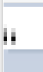
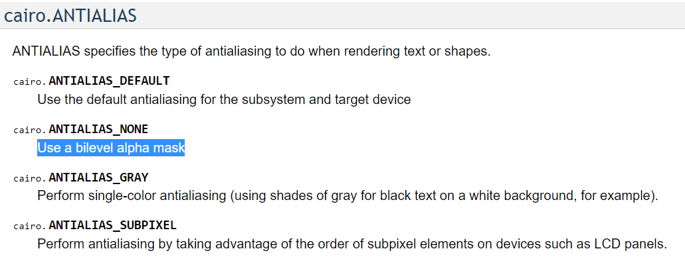

# rcairo

https://rcairo.github.io/

## install ruby3.1.3-1-x64 on Windows

https://rubyinstaller.org/downloads/

https://notepad.onghu.com/2021/ruby3-windows-day0-install-hello_world/

## install rairo

https://notepad.onghu.com/2021/ruby-cairo-installation-windows/

警告dependency cycle没关系的，还是能继续安装

## example

https://notepad.onghu.com/2021/cairo-samples-in-ruby/

https://github.com/rcairo/rcairo/blob/master/samples/png.rb

https://notepad.onghu.com/2021/cairo-rcairo-porting/

## debug: Cairo::ANTIALIAS_NONE不是M4想要的那种binary image

RGB24时候原来都不是1像素

A1的时候大概是用了某个灰度阈值来切分的

就算用线宽0.1，结果是单个像素的RGB24颜色很淡，变成A1直接没有这个像素了。

现在的问题是，像素由M4点决定这个基础理论站不住了，由于线宽的存在，渲染到周边像素，所以应该要有新的基础理论了。

https://www.cairographics.org/documentation/pycairo/3/reference/constants.html#cairo-antialias

https://www.cairographics.org/documentation/pycairo/3/reference/constants.html#cairo-format

啊不是RGB24和A1区别的关系，而是开启了antialias模式c.set_antialias(Cairo::ANTIALIAS_NONE)的关系！

**Cairo::ANTIALIAS_NONE应该是不等于M4论文中所讨论的那种binary image！！！！！**

**我猜Cairo::ANTIALIAS_NONE是从灰度图设置一个阈值然后0-1化得到的，和那种经过某个像素就完全置1的binary image是不一样的！**

**举个例子：如果就画一个点，按照binary image，那个点所在的像素应该置为1了，但是按照Cairo::ANTIALIAS_NONE，由于这一个点灰度很淡达不到置为1的阈值，最终这个像素并不会置1！！！！！！**

而如果自己手动把灰度图设置只要有一点灰度就置1，换言之把阈值调小成0，那似乎也不是M4想要的那种binary image，因为一个像素列内的点如果很靠近边边，其线宽影响到周围像素从而破坏了M4理论基础。

思考：如果能真的关掉antialias，那就等于M4想要的binary image吗？

Q1：关掉antialias的render方式等于M4想要的binary image吗？关掉antialias是不是就是h老师他们说的那种图形学栅格化的像素集合？

Q2：cairos能关掉antialias吗？至少现在看来Cairo::ANTIALIAS_NONE不是对的方式。难道要自己手写画像素的程序吗？